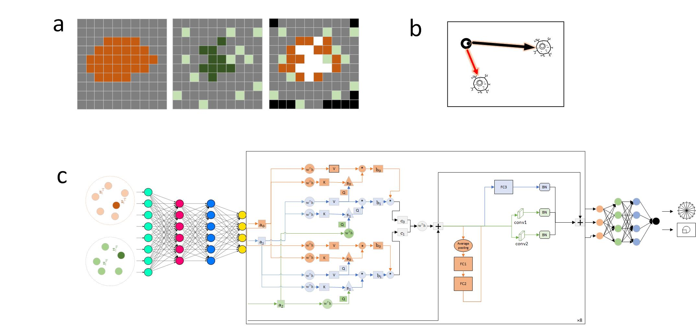

# SSL-CST
A cell segmentation method based on the principles of self-supervised learning. A unique property is that the method fully integrates the information from staining images and gene expression data, leveraging both the positional characteristics and gene expression profiles of each point within the tissue sample.A self-supervised network is employed to classify all points in the stained image to obtain high-precision cells.



## Installation
SST-CST depends on the  packages in requirements.txt. To speed up the training process,SST-CST  relies on Graphic Processing Unit (GPU). If no GPU device is available, the CPU will be used for model training.

```conda create -n SSL-CST python=3.8```  
```pip install -r requirements.txt```

## Usage
The data needed for the method is segregated into two components: spatial transcriptome sequencing data and the accompanying nuclear staining images. The sequencing data should encompass essential information, including the gene type, its coordinates, and the intensity of gene expression.

You can run a demop from the command line:


```python SSL-CST.py```

## Results
The final output reports the information of cells in the spatial transcriptome stained image.


